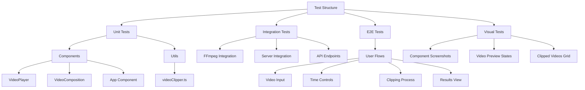

# Testing Plan Discussion

After analyzing the Viscera video clipping tool's codebase, I have created a comprehensive testing plan. The tool consists of:

## Core Components Analyzed
1. VideoPlayer.tsx - Remotion-based video player component
2. VideoComposition.tsx - Video playback with time controls
3. videoClipper.ts - FFmpeg integration for video processing
4. App.tsx - Main application logic and UI

## Proposed Testing Strategy

## Implementation Options

1. **Full Implementation**: Set up the complete test environment with Jest, Puppeteer, and visual testing tools. This includes:
   - Unit tests for all components
   - Integration tests for FFmpeg and server
   - E2E tests for user flows
   - Visual regression testing

2. **E2E Focus**: Start with Puppeteer tests to validate core user flows:
   - Video URL input
   - Time control interaction
   - Clipping process
   - Results viewing

3. **Component-First**: Begin with unit tests for components:
   - VideoPlayer tests
   - VideoComposition tests
   - videoClipper utility tests
   - Then progress to integration and E2E tests